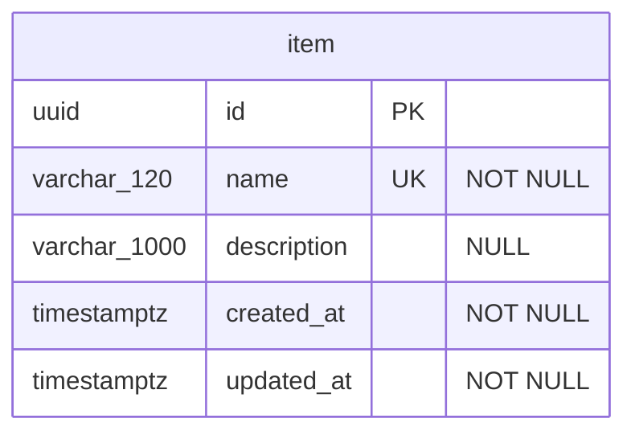

# Operational Database — Physical Data Model

The operational database is the single PostgreSQL database App owns for its own
state. This document is the physical view: the tables, columns, constraints and
indexes Flyway actually creates. For the reasoning behind the persistence
approach, see [ADR-008](../../adr/ADR-008-postgresql-spring-jdbc-flyway.md) and
[ADR-021](../../adr/ADR-021-one-migration-stream-and-one-baseline.md).

The template carries one table, `item`, the example aggregate. Replace it — and
this document — as the first real aggregate lands.

## 1. Deployment shape

One database, one schema (`public`), one Flyway migration stream:

| Migration location | History table | Applied by |
| --- | --- | --- |
| `classpath:db/migration` (`adapters/persistence`) | `flyway_schema_history` | Spring Boot's autoconfigured Flyway in `apps/api`, at startup |

The stream starts with one migration,
[`V1__baseline.sql`](../../../adapters/persistence/src/main/resources/db/migration/V1__baseline.sql).
A migration written from now on is `V2__...` or higher, belongs to the same
stream whichever subdomain its tables serve, and is never edited once it has
shipped (ADR-021 states the one exception).

Flyway exclusively owns the schema — there is no runtime schema generation. A
failed migration or an unreachable database fails application startup, so the
API never serves traffic without its schema. The CLI never touches the database
([ADR-026](../../adr/ADR-026-cli-is-a-client-of-the-api.md)).

Local defaults (`compose.yaml`, `.env.example`): database `app`, user `app`,
port `5432`.

## 2. Entity-relationship diagram

## 3. Table reference

### `item`

The example aggregate: a named thing with an optional description.

| Column | Type | Null | Notes |
| --- | --- | --- | --- |
| `id` | `uuid` | no | Primary key. Assigned by the application through the `IdGenerator` port, never by a column default ([ADR-023](../../adr/ADR-023-identifiers-are-uuids.md)) |
| `name` | `varchar(120)` | no | Unique. The API refuses an empty name before it reaches the database |
| `description` | `varchar(1000)` | yes | |
| `created_at` | `timestamptz` | no | Set once, from the `TimeSource` port |
| `updated_at` | `timestamptz` | no | Set on every update, from the `TimeSource` port |

| Constraint | Kind | Rule |
| --- | --- | --- |
| `item_pkey` | Primary key | `id` |
| `item_name_unique` | Unique | `name` — a duplicate surfaces as `UniqueConstraintViolation`, and the API answers `409 ITEM_NAME_EXISTS` |
| `item_updated_after_created` | Check | `updated_at >= created_at` |

Indexes: the two implied by the primary key and the unique constraint. The list
endpoint orders by `name`, which the unique index serves.

## 4. Conventions and invariants

- **Identifiers** are `uuid`, generated by the application
  ([ADR-023](../../adr/ADR-023-identifiers-are-uuids.md)).
- **Time** — every instant is `timestamptz`, written from `TimeSource`, never
  from `now()` in SQL, so tests control the clock.
- **Names** — tables and columns are `snake_case`, singular table names. A
  subdomain's tables share a prefix when it owns more than one (`order`,
  `order_line`).
- **Constraints are named** — `<table>_<column>_unique`, `<table>_<rule>` for
  checks — so the adapter can translate a violation by name.
- **Invariants live in the database where a race would otherwise break them.**
  Uniqueness is a constraint, not an application check-then-insert.
- **Enumerations** are stored as `text` with a `CHECK` constraint listing the
  values, and mapped to a `core` enum — never to a generated contract enum
  ([ADR-002](../../adr/ADR-002-layered-core-and-apps-boundary.md)).
- **JSONB** only for structures the database never needs to search or constrain.

## 5. Source of truth

The migrations are authoritative. When they change, update this document in the
same commit.

| Concern | File |
| --- | --- |
| Schema | [`adapters/persistence/src/main/resources/db/migration/`](../../../adapters/persistence/src/main/resources/db/migration/) |
| Flyway and datasource configuration | [`apps/api/src/main/resources/application.yml`](../../../apps/api/src/main/resources/application.yml) |
