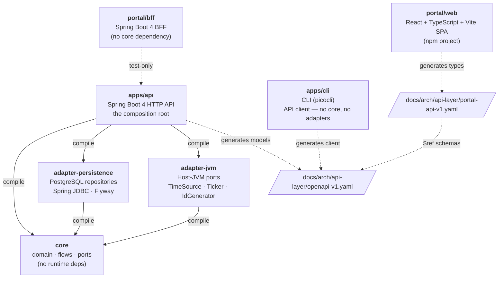
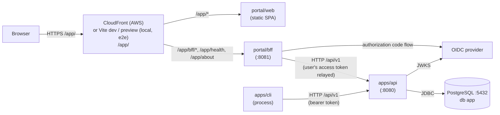

# Module Dependency Map

The compile-time Maven module graph, the runtime communication paths, and the
constraints the build enforces on both.

## Maven modules

Six modules make up the build reactor, declared in the root `pom.xml`
(parent `com.example.app:app-parent`):

| Module path | Maven artifact | Deliverable |
| --- | --- | --- |
| `core` | `core` | Library JAR — no runtime dependencies |
| `adapters/persistence` | `adapter-persistence` | Library JAR |
| `adapters/jvm` | `adapter-jvm` | Library JAR |
| `apps/api` | `api` | Spring Boot executable JAR |
| `portal` | `portal` | Spring Boot executable JAR (the BFF, `portal/bff`) |
| `apps/cli` | `cli` | Shaded executable JAR (picocli, no Spring, no JDBC) |

`portal/web` (the React SPA) is not a Maven module. It is a standalone npm
project whose build and tests run as their own CI step. Its static bundle has
no server or reverse proxy of its own: CloudFront + S3 serve it in AWS, and the
Vite dev server or `vite preview` serves it locally and in browser tests
([ADR-017](../adr/ADR-017-static-spa-without-a-reverse-proxy.md),
[ADR-025](../adr/ADR-025-aws-deployment-topology.md)). `compose.yaml` runs
PostgreSQL, the API and the BFF only.

## Compile-time dependency graph

Arrows are `compile`-scope Maven dependencies unless labelled otherwise.
Dashed edges are test-only or build-time.



## Runtime communication



The edge is CloudFront in AWS, with an S3 origin for the SPA and the BFF
behind the ALB as its second origin. Locally and in browser tests it is the Vite
server (`npm run dev`, or `vite preview` over the built bundle), whose proxy in
`portal/web/vite.config.ts` forwards `/app/bff`, `/app/health` and `/app/about`
to `:8081`. No SPA client route may start with one of those segments.

## Enforced architectural constraints

Build-time rules that fail `mvn validate`:

| Rule | Enforced in | What it bans |
| --- | --- | --- |
| `ban-infrastructure-dependencies` | `core` | Spring, Spring Boot, JDBC drivers, Flyway, Hibernate/JPA, cloud SDKs, Lombok, logging artifacts, and the other frameworks listed in the POM |
| `ban-logging-apis-in-core` | `core` | Any logging import or `System.out`/`System.err` in `core/src/main` — a JDK package the dependency rule cannot see |
| `ban-core-dependency` | `portal` | A direct `core` compile dependency (non-transitive; `core` reaching the test classpath through the test-scoped `api` dependency is allowed) |
| `ban-cli-internal-dependencies` | `apps/cli` | `core`, every `adapters/` module, and `api` (non-transitive, same allowance) |

See [ADR-003](../adr/ADR-003-core-dependency-exclusions.md),
[ADR-009](../adr/ADR-009-react-typescript-and-spring-bff.md),
[ADR-016](../adr/ADR-016-one-logging-story-and-a-silent-core.md) and
[ADR-026](../adr/ADR-026-cli-is-a-client-of-the-api.md).

**A module boundary that one POM line can undo gets an enforcer, not prose.**
The rings *inside* `core` are a different kind of boundary: they are checked by a
nightly ArchUnit report that blocks no pull request, run with
`mvn -Parchitecture verify`
([ADR-015](../adr/ADR-015-archunit-nightly-ring-report.md)).

Tests that also hold the contract:

| Test | Holds |
| --- | --- |
| `ContractPathsAreServedTest` (`apps/api`) | Every path in `openapi-v1.yaml` has a controller mapping |
| `BffContractParityTest` (`portal`) | Every `x-proxies-to` in `portal-api-v1.yaml` names an operation declared in `openapi-v1.yaml` |

## Module descriptions

### `core`

Three package rings — `domain`, `flows`, `ports` — under `com.example.app`, each
subdivided by subdomain. Dependencies run `flows → ports → domain`; `domain`
depends on nothing. No I/O, no framework, no driver, no logging: everything
infrastructural goes behind a port implemented by an adapter
([ADR-002](../adr/ADR-002-layered-core-and-apps-boundary.md),
[ADR-004](../adr/ADR-004-core-touches-no-io.md)).

```text
core/src/main/java/com/example/app/
├── domain/
│   ├── error/         # ApplicationProblem, ProblemKind, ProblemException, UniqueConstraintViolation
│   ├── security/      # AppRole
│   └── item/          # the example aggregate
├── flows/
│   └── item/          # use cases over ports
└── ports/
    ├── identity/      # IdGenerator
    ├── time/          # TimeSource, Ticker
    ├── transaction/   # UnitOfWork
    └── item/          # ItemRepository and its DTOs
```

### `adapter-persistence`

Implements the repository ports with Spring JDBC (`JdbcClient`) and explicit SQL
under `com.example.app.persistence`. Owns the Flyway migrations for the schema it
assumes — one stream, starting from `V1__baseline.sql`
([ADR-008](../adr/ADR-008-postgresql-spring-jdbc-flyway.md),
[ADR-021](../adr/ADR-021-one-migration-stream-and-one-baseline.md)). Does not
pull in Spring Boot autoconfiguration; the datasource, pool and credentials are
the composition root's to assemble. Integration tests run against a
Testcontainers PostgreSQL ([ADR-006](../adr/ADR-006-testcontainers-for-integration-tests.md)).

### `adapter-jvm`

Adapts the host JVM's non-deterministic facilities to the core ports:
`TimeSource` (the system clock), `Ticker` (`System.nanoTime`) and `IdGenerator`
(`UUID`). No runtime dependency beyond `core`. `apps/api` is its only consumer.

### `apps/api`

The Spring Boot 4 composition root
([ADR-007](../adr/ADR-007-spring-boot-http-api-composition-root.md)). Wires
`adapter-persistence` and `adapter-jvm` into `core`'s flows, owns security
(`app.auth.mode` = `jwt` | `dev-token`,
[ADR-011](../adr/ADR-011-jwt-resource-server-and-roles.md)), and maps each
`ProblemKind` to an HTTP status in one place. Generates its contract models from
`openapi-v1.yaml` into `com.example.app.api.contract.model`
([ADR-012](../adr/ADR-012-generated-contracts-and-remote-frontend-state.md));
controllers are hand-written and thin. Serves the contract verbatim at
`/v3/api-docs.yaml`. A generated contract type never appears below `apps/`.

### `apps/cli`

A client of the application API, not a composition root
([ADR-026](../adr/ADR-026-cli-is-a-client-of-the-api.md)). Declares no
dependency on `core`, any adapter, or `api`; opens no database connection and
runs no migration. Its client is generated from the same `openapi-v1.yaml` into
`com.example.app.cli.contract`, so the contract is the coupling and the module is
not. Its stdout is a contract its `*IT` suites assert on; every log line goes to
stderr.

### `portal` — BFF + SPA

**`portal/bff/`** (Spring Boot 4, `com.example.app.portal`): a thin
authenticated proxy. It strips `/app/bff/v1`, forwards to `/api/v1`, reshapes
nothing, and attaches the upstream bearer token itself — the user's access token
from the server-side session in `oidc` mode, `APP_AUTH_DEV_TOKEN` in `dev` mode
([ADR-010](../adr/ADR-010-oidc-server-side-session-and-browser-security.md)).
No compile dependency on `core` (enforced). Design:
[portal-api-v1-bff.md](api-layer/portal-api-v1-bff.md).

**`portal/web/`** (React 18, TypeScript, MUI 5, Vite, React Query): a standalone
npm project under base path `/app/`, with types generated from
`portal-api-v1.yaml` ([ADR-009](../adr/ADR-009-react-typescript-and-spring-bff.md),
[ADR-013](../adr/ADR-013-mui-wcag-22-aa-design-system.md)).

## Contract files

| File | Role |
| --- | --- |
| `docs/arch/api-layer/openapi-v1.yaml` | The application API contract. Hand-maintained and authoritative; `apps/api` generates its models and `apps/cli` its client from it; served verbatim at runtime |
| `docs/arch/api-layer/portal-api-v1.yaml` | The browser-to-BFF contract. References the API's schemas rather than duplicating them; the SPA's types are generated from it |
