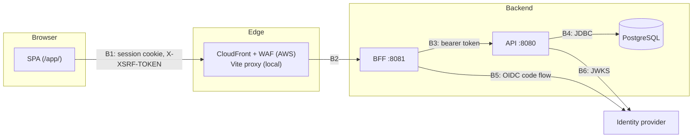

# Threat Model

- Status: Template — fill in for the product, then set `Proposed`
- Date: YYYY-MM-DD
- Scope: browser, SPA, BFF, identity provider, application API, database, CI
  and deployment
- Related: [Identity and Authentication](identity-and-authentication.md),
  [ADR-010](../../adr/ADR-010-oidc-server-side-session-and-browser-security.md),
  [ADR-011](../../adr/ADR-011-jwt-resource-server-and-roles.md),
  [ADR-025](../../adr/ADR-025-aws-deployment-topology.md)

<!--
How to use this template

The sections below are pre-filled with what the template architecture already
decides (the BFF pattern, JWT validation, CSRF, Problem Details). Keep what
still holds, delete what does not, and add the assets and threats your domain
introduces — the `item` rows are placeholders. Revisit on every trigger in §12.
-->

## 1. Purpose

Identify the assets, actors, trust boundaries, threats, controls, evidence and
residual risks of the product. This does not replace organizational threat
modeling, penetration testing or a cloud security review.

The model assumes every input can be hostile or malformed: request bodies, path
and query parameters, identity claims, headers, URLs, browser state, and responses
from any service.

## 2. Security objectives

1. Keep access, refresh and ID tokens out of browser JavaScript and browser
   storage.
2. Make the API the only authorization decision; no UI route or BFF operation
   bypasses it.
3. Prevent untrusted content from becoming code, SQL, a path, a header, or markup.
4. Keep every mutation authenticated, authorized, CSRF-protected and attributable.
5. Never leak internals — stack traces, SQL, secrets — through errors or logs.
6. Keep resource usage bounded at every tier.
7. <Domain objective.>

## 3. Assets

| Asset | Security property |
| --- | --- |
| OIDC authorization code, tokens, session id, CSRF token | Confidentiality, integrity, short lifetime |
| Role claims | Integrity, freshness |
| `APP_AUTH_DEV_TOKEN`, OIDC client secret, database credentials | Confidentiality |
| Application data (`item` rows — replace) | <Integrity, confidentiality, availability> |
| Logs and correlation ids | Integrity, minimization |
| Contracts, generated clients, container images, frontend bundle | Integrity, supply-chain provenance |
| API, BFF and database capacity | Availability |

## 4. Actors

### 4.1 Intended actors

| Actor | Reaches | Role |
| --- | --- | --- |
| Reader | Portal, API | `READER` |
| Editor | Portal, CLI, API | `READER`, `EDITOR` |
| Administrator | Portal, CLI, API | `ADMIN` (plus others as needed) |
| Automation client | API | Service account token from the identity provider |

### 4.2 Threat actors and failure sources

- an unauthenticated internet client;
- an authenticated user attempting an operation beyond their roles;
- a malicious page in the same browser (CSRF, clickjacking);
- a compromised or misconfigured dependency or build step;
- an operator mistake (wrong mode, leaked secret, wrong environment);
- <domain-specific actor>.

## 5. Trust boundaries

| Boundary | Crossing | Controls |
| --- | --- | --- |
| B1 | Browser to edge | TLS; session cookie `HttpOnly`/`Secure`/`SameSite`; CSRF header on mutations; security headers (CSP, frame-ancestors) |
| B2 | Edge to BFF | Only `/app/bff/**`, `/app/health`, `/app/about` routed; WAF in AWS |
| B3 | BFF to API | Bearer token on every call; API validates it independently of the BFF |
| B4 | API to database | Least-privilege database role; parameterized SQL only |
| B5 | BFF to identity provider | Authorization code flow, `state` validation, exact redirect URI |
| B6 | API to identity provider | JWKS over TLS; issuer and audience checks |

## 6. Assumptions

- The identity provider is trusted to authenticate users and issue correct role
  claims.
- TLS terminates at the edge in every shared environment.
- `dev-token` / `dev` modes never run in a shared environment; the API refuses
  `dev-token` under profile `prod`.
- <Assumption.>

## 7. Threat analysis

Use STRIDE per boundary. One row per threat; every row names its control and the
evidence that the control works.

| ID | Boundary | Threat (STRIDE) | Control | Evidence | Residual |
| --- | --- | --- | --- | --- | --- |
| T-01 | B1 | Token theft by XSS (I) | Tokens never reach the browser; server-side session | BFF test: no token in any response body or header | Session riding while XSS persists |
| T-02 | B1 | Cross-site request forgery (T) | `XSRF-TOKEN` cookie / `X-XSRF-TOKEN` header | BFF test: mutation without header answers `403` | — |
| T-03 | B3 | Forged or expired token (S) | JWT signature, issuer, expiry validation | API test: tampered, expired, wrong-issuer tokens answer `401` | — |
| T-04 | B3 | Privilege escalation (E) | Role check per operation in the API | API test: each write without `EDITOR` answers `403` | — |
| T-05 | B4 | SQL injection (T) | Parameterized `JdbcClient` statements only | Code review; persistence `*IT` with hostile input | — |
| T-06 | B1 | Stored XSS through item fields (T) | React escaping; no `dangerouslySetInnerHTML`; CSP | Portal test rendering hostile strings | — |
| T-07 | B3 | Internal detail in errors (I) | Problem Details only; no message, stack or SQL | API test on each error path | — |
| T-08 | B2 | Request flooding (D) | WAF rate rules; bounded request size; pool limits | <Load test> | <...> |
| T-09 | — | Dev mode in a shared environment (S, E) | Startup refusal under `prod`; mode visible at `/about` | Startup test | Non-`prod` shared environments |
| T-10 | — | <Domain threat> | <Control> | <Evidence> | <Residual> |

## 8. Supply chain and build

- Dependencies pinned by version; dependency and image scanning in CI
  (`.github/workflows/`).
- Contracts are hand-maintained and reviewed; generated code is never edited.
- Container images built from pinned base images; no secrets in images or layers.
- CI secrets scoped to the workflows that need them.

## 9. Logging and repudiation

- Every request carries a correlation id, logged on every line (`%X{correlationId}`)
  and returned in `X-Correlation-ID` and in every Problem Details body.
- Logs never contain tokens, cookies, passwords or request bodies with personal
  data.
- <What is audited, if anything, and where.>

## 10. Security acceptance evidence

| Control | Test or check | Runs in |
| --- | --- | --- |
| JWT validation and role checks | API security tests | `mvn clean verify` |
| CSRF and session handling | BFF security tests | `mvn clean verify` |
| No token in the browser | Browser acceptance | Browser acceptance lane |
| <Control> | <Test> | <Where> |

## 11. Residual-risk register

| ID | Risk | Owner | Accepted until | Mitigation plan |
| --- | --- | --- | --- | --- |
| R-01 | In-memory BFF sessions are lost on restart and need sticky routing across replicas | <owner> | <date> | Spring Session when scaling out |
| R-02 | <Risk> | <owner> | <date> | <plan> |

## 12. Review triggers

Revisit this model when any of these changes:

- a new trust boundary, external integration or data store;
- a new role, or a change to what a role grants;
- a new category of sensitive data;
- a change of identity provider, session store or deployment topology;
- a security incident or a penetration-test finding.
