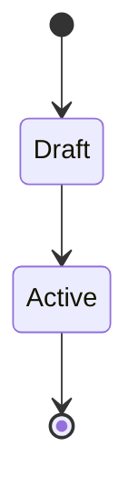

# FS-0XX: <Capability title>

- Status: Draft
- Date: YYYY-MM-DD
- Primary actors: <who uses the capability — a role from `AppRole`, an
  automation client, an operator>
- Depends on: <FS-0XX specifications this one builds on, or "none">

<!--
How to use this template

- Copy it to `FS-0XX-short-capability-title.md` with the next free number and
  add a row to the table in `README.md`.
- Number requirements from FR-001, security requirements from SEC-001 and
  acceptance criteria from AC-001, contiguously, inside this file only.
- Keep each §6 subsection a contiguous FR range, so an issue can cite the range
  and mean exactly that area.
- Delete every placeholder, and every optional section you do not need.
- Priority is not set here. Each In-scope item becomes one or more features
  (`FS-0XX-F##`) in docs/plans/feature-register.md, which carries its tier.
-->

## 1. Purpose

<Two or three paragraphs: the problem this capability solves, for whom, and why
now. State the outcome a user can observe, not the implementation.>

## 2. Functional boundary

### 2.1 In scope

- <Capability the specification delivers. Each bullet is a candidate feature in
  the register.>
- <...>

### 2.2 Out of scope

- <Behaviour deliberately not required, and — where it is known — which
  specification or future capability owns it.>

## 3. Actors and interfaces

| Actor | Interface | Role required |
| --- | --- | --- |
| <Reader> | Portal, `GET /api/v1/<resources>` | `READER` |
| <Editor> | Portal, CLI, `POST /api/v1/<resources>` | `EDITOR` |

## 4. Core concepts

### 4.1 <Concept>

<Definition, invariants, lifecycle. Use the terms in the root `CONTEXT.md`; add a
term there when this specification introduces one.>

## 5. Functional flow

<The main path, step by step, and the decision points. A sequence or state
diagram in Mermaid is welcome here.>

## 6. Functional requirements

### 6.1 <Functional area>

**FR-001 — <Short title>**

The system shall <one observable, testable obligation>.

**FR-002 — <Short title>**

When <condition>, the system shall <behaviour>.

### 6.2 <Functional area>

**FR-003 — <Short title>**

The system shall <...>.

## 7. Contract

<The operations this specification adds or changes, by method and path, and the
contract file that declares them. The contract is the truth of the wire; this
section says what the operations mean.>

| Operation | Path | Contract |
| --- | --- | --- |
| <List> | `GET /api/v1/<resources>` | `docs/arch/api-layer/openapi-v1.yaml` |

## 8. Result states and error contract

| Condition | HTTP status | Problem `code` |
| --- | --- | --- |
| <Resource does not exist> | 404 | `<RESOURCE>_NOT_FOUND` |
| <Unique name already taken> | 409 | `<RESOURCE>_NAME_EXISTS` |
| <Request fails validation> | 400 | `VALIDATION_FAILED` |

## 9. Security requirements

**SEC-001 — <Short title>**

<Authorization, data exposure, secrets, audit. Every SEC is covered by an
acceptance criterion like any FR.>

## 10. Acceptance criteria

Acceptance runs in `mvn clean verify` against a Docker-compatible runtime. A
skipped Testcontainers suite is not acceptance evidence.

### AC-001 — <Short title>

- **Given** <state>
- **When** <action>
- **Then** <observable outcome>

### AC-002 — <Short title>

- **Given** <...>
- **When** <...>
- **Then** <...>

## 11. Test strategy

<Which levels prove what: unit tests over `core` flows with in-memory port
doubles, `*IT` suites over the real HTTP API and PostgreSQL, portal component
tests, browser acceptance.>

## 12. Non-functional constraints

<Performance, determinism, accessibility (WCAG 2.2 AA for portal surfaces),
portability, scale. Only constraints someone will verify.>

## 13. Known limitations

<What the delivered capability will not do, stated so nobody infers it.>

## 14. Future capabilities registered by this specification

<Ideas deliberately left out, so they are recorded rather than inferred. None of
these is an obligation.>

## 15. Implementation impact — non-normative

<Modules and rings touched (`core` domain/flows/ports, `adapters/persistence`,
`apps/api`, `portal`, `apps/cli`), migrations, contract version changes. This
section guides the work and binds nobody.>

## 16. Definition of Done

FS-0XX is complete only when:

- every AC-001 through AC-0NN has reproducible, non-skipped evidence;
- the contracts and this specification agree;
- the ADRs this capability requires are `Accepted`;
- the feature register rows for FS-0XX carry their result and evidence;
- <capability-specific checks>.

## 17. Requirement traceability

Every functional and security requirement is covered by at least one acceptance
criterion, or the note says why not.

| Requirement | Acceptance criteria | Note |
| --- | --- | --- |
| FR-001 | AC-001 | |
| FR-002 | AC-002 | |
| FR-003 | — | <Negative requirement; nothing to exercise> |
| SEC-001 | AC-002 | |

## 18. Related decisions

| ADR | Relevance |
| --- | --- |
| [ADR-002](../adr/ADR-002-layered-core-and-apps-boundary.md) | Where the model, flows and ports of this capability live |
